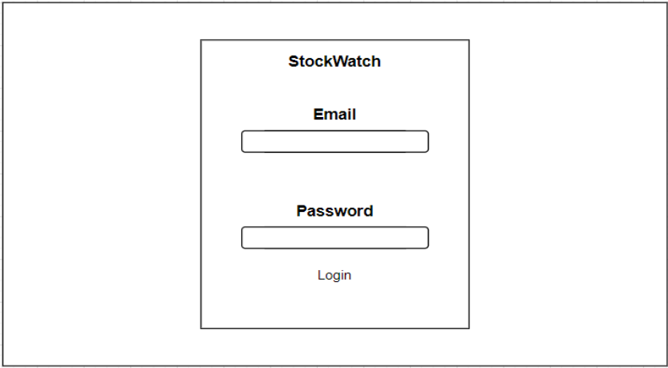
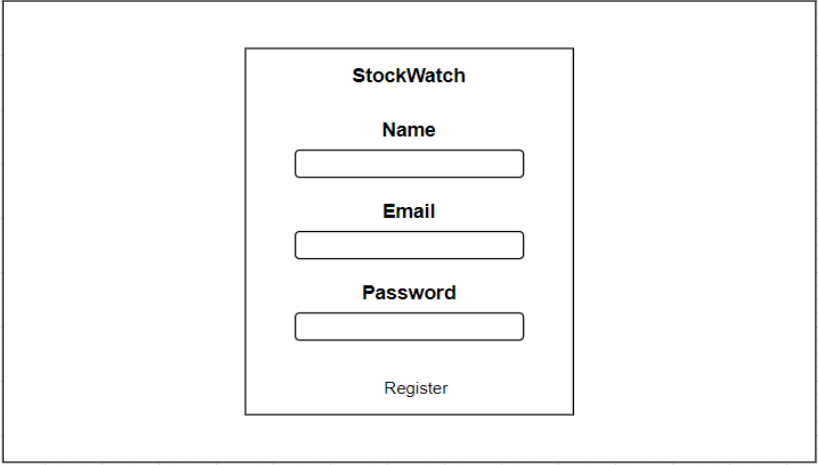
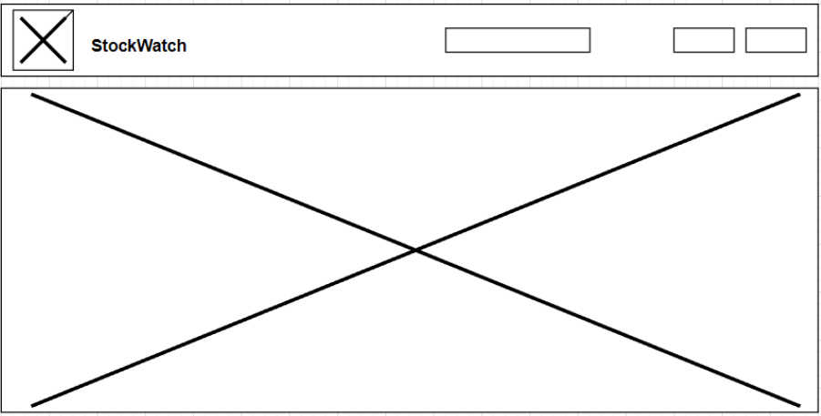
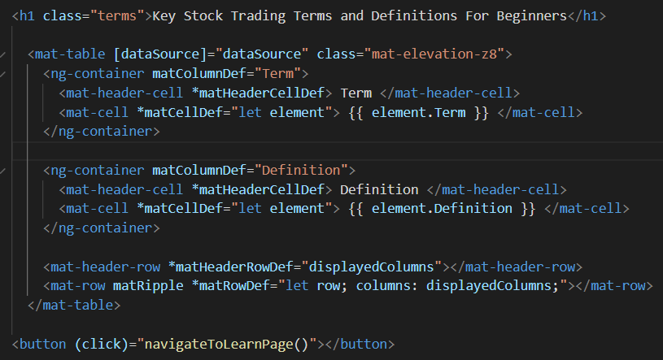
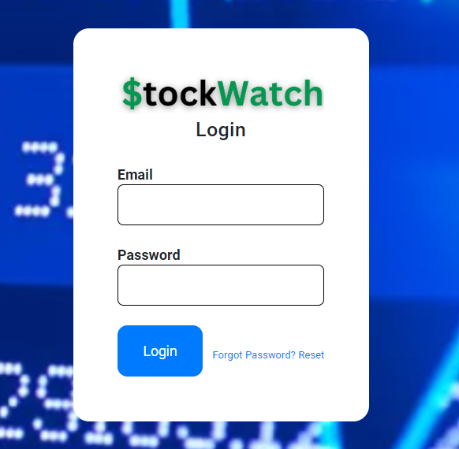
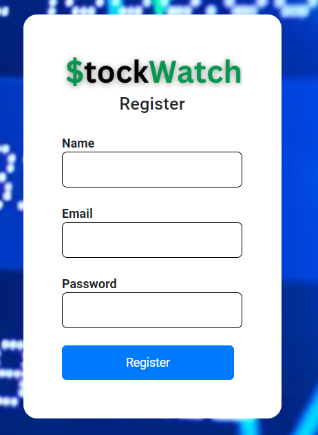

# StockWatch:chart:
<h1>Introduction</h1>
As a beginner or novice investor, it’s important to make informed financial decisions. StockWatch is designed to simplify the complexities of the stock market.  Gain valuable insights, set personalized alerts, and track your favorite stocks with ease. With StockWatch, you can confidently make sound purchases when the time comes to invest in your first stock. To check out the backend API for StockWatch <a href="https://github.com/vnpugh/StockWatch_Backend">click here.</a>
<h2>Running the Application</h2>
To run the StockWatch application, follow these steps:
<ol>
  <li>Clone the repository: Start by cloning the StockWatch repository to your local machine. This can be done using the Git clone command in your preferred terminal.</li>
  <li>Set up the backend API: Open your code editor, preferably Visual Studio Code, and navigate to the main (root) folder of the project. Use the appropriate tools, such as IntelliJ or Tomcat, to run the backend API server.</li>
  <li>Launch the frontend server: Open your command line interface (e.g., Bash, PowerShell) and navigate to the main folder of the StockWatch project. Use the command 'ng serve --open' to launch the Angular server. This will open your default web browser and take you to the application at localhost:4200.</li>
  <li>Ensure both servers are running: It's important to note that StockWatch consists of two separate applications: the Backend API and the Frontend. Make sure you have both servers running simultaneously. Verify that the backend API server is running in your chosen IDE or server environment, while the Angular server is active in your terminal.</li>
</ol>

By following these steps, you will have both the Backend API and the Frontend server up and running. This will allow you to access the StockWatch application through your web browser and begin utilizing its features.

<h2>Tools & Technologies Used🛠️</h2>
<ul>
  <li> Project Management: Github Projects (One Board for Backend & Frontend)</li>
  <li>AngularJs</li>
  <li>VS Code</li>
 <li><a href="https://material.angular.io/">Angular Material</a></li>
 <li>HTML5/CSS3</li>
<li>Bootstrap</li>
<li>Daisy UI</li>
<li>Googlefonts</li>
<li>Canva</li>
<li>Diagrams.net</li>
</ul>

<h2>Frontend Project Approach:desktop_computer:</h2>

In developing StockWatch, my strategic approach involved prioritizing the backend implementation to ensure the core functionality of the application was effectively implemented as a minimum viable product. Once the backend functionality was established, I dedicated my attention to refining and enhancing the frontend user interface.

After selecting a project topic, I began to create the wireframes for the login, registration, and home page:

After completing the wireframes, I created the logo for StockWatch in Canva to save time on styling:

To optimize development time and maintain a consistent and professional design, I leveraged popular frontend frameworks such as Bootstrap, Daisy UI, and Angular Material. These frameworks provided a solid foundation for creating visually appealing and responsive components, including forms, tables, buttons, and the navigation bar.
Please take a look at my Github Projects Board <a href="https://github.com/users/vnpugh/projects/5/views/1?layout=board">HERE.</a>

<h2>What I learned/Wins:brain:</h2>

When it came to styling, I embraced the opportunity to enhance the user experience by leveraging Angular Material. By incorporating Angular Material's comprehensive suite of pre-designed components, I was able to effortlessly add visually appealing forms, buttons, and tables/grids to the project pages. The extensive collection of Material design components provided me with the tools needed to create custom components with consistent and intuitive interaction patterns. This allowed me to elevate the aesthetics and functionality of the application, ensuring a seamless and engaging user interface.
  

<h2>Discover the Powerful Features of StockWatch (Login/Register):chart:</h2>
<ul>
<li>Simplify Your Stock Tracking: Register for an account and create a custom watchlist, enabling you to effortlessly organize and monitor your favorite stocks.</li>
<li>Secure and Personalized Access: Log in to your account securely to gain personalized access to your watchlist, ensuring a tailored stock tracking experience.</li>
<li>Efficient Stock Search: Seamlessly search for stocks using company names or ticker symbols, enabling you to swiftly find the information you need.</li>
<li>Stay Informed and Updated: Keep a close eye on your investments with the ability to view all stocks on your watchlist, empowering you with up-to-date insights and performance metrics.</li>
<li>Streamlined Stock Addition: Add stocks to your watchlist effortlessly by entering their ticker symbols, allowing you to easily monitor their progress and stay ahead of market trends.</li>
<li>Flexible Stock Management: Customize your watchlist by deleting stocks that are no longer of interest, ensuring your portfolio is always aligned with your investment goals.</li>
</ul>
Experience StockWatch today and unlock the power to track stocks with precision and convenience.

<h2>Final UI (Login & Register Pages)</h2>

<h1>Credits / MVPS:star::star::star::star::star:</h1>

Thank you to all of the instructors and my classmates for your assistance!

<ul>
<li><a href="https://github.com/sureshmelvinsigera/">Suresh Sigera</a></li>
<li><a href="https://github.com/LRodriguez9">Leo Rodriguez</a></li>
<li><a href="https://github.com/akshayankolekar">akshayankolekar: </a>Thank you for answering my questions and explaining how to make the project better!</li>
<li><a href="https://github.com/maklaut007">Maksym Zinchenko</a></li>
</ul>

